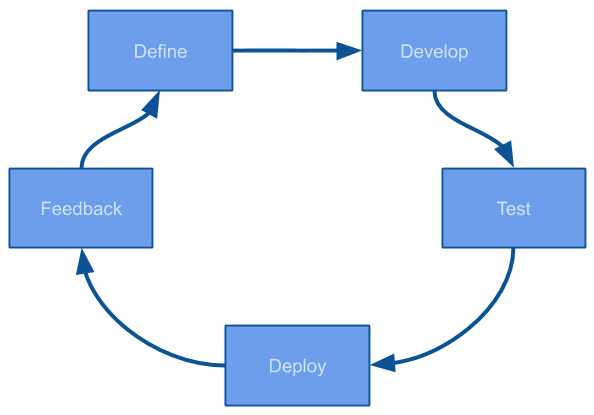

### Define

Todo debe empezar con una definición, si no tenemos claro qué es lo que estamos haciendo. ¿Cómo sabremos cuando lo hayamos terminado?

Debe haber un solo punto donde ir a buscar la información. (Monday)

También es importante definir un estimado de esfuerzo (tiempo) que nos va a tomar realizar algo.

Todas estas definiciones nos ayudan a planear y detectar temprano problemas.

### Develop

Una vez que tengas que empezar a desarrollar algo, empieza por asegurarte que entiendes lo que se definió, mientras mas pronto se resuelvan todas las dudas evitamos trabajo desperdiciado por no entender el requerimiento.

Todo nuevo desarrollo debe crearse a partir de la última versión funcionando del código. Para eso usamos git-flow. Cada nuevo feature debe salir de develop.

Una vez que hayas terminado tu feature, debes crear un Pull Request que incluya todos tus cambios para que el equipo pueda revisarlo.

El líder del equipo es el que tiene la responsabilidad, de una vez que hayan pasado el code review integrar tus cambios a develop.

Todo esto se explica más a fondo en la [Guía para contribuir](desarrollo/documents/CONTRIBUTING.md).

En los casos donde lo que se te asignó sea muy complejo o afecte a muchos módulos, es mejor partirlo en cambios incrementales que se puedan ir entregando gradualmente. Esto nos permite evitar PR donde haya que revisar decenas de archivos con centenas de cambios.

### Test

La mejorar forma de asegurarnos que siempre estamos entregando Sotware Funcional es probando. 

Si alguna vez has escuchado la frase "Es que no quiero moverle por que tengo miedo de romper algo más" eso es una señal de que necesitas pruebas. Las pruebas nos ofrecen la tranquilidad de que ningún cambio va a romper el sistema.

Antes de que el programador termine su feature debe probar que cumple con la definición y que no tiene efecto secundarios en otros componentes relacionados.

Adicionalmente, cada PR debe venir acompañado de pruebas unitarias.

Una vez que el PR se aprueba y pasa a develop, un sistema de integración continua debe publicar tus cambios en un entorno de pruebas (a esto solemos llamarle integración).

Es importante que el programador pruebe de nuevos sus features en integración.

Aparte de las pruebas unitarias el equipo de QA realiza una serie de pruebas de integración para asegurarse que todo siga funcionando, cada que QA encuentre un error se lo reportará al equipo para que se solucione a la brevedad. Desde el momento en que se reporta y hasta que se corrija se considera que "el build está roto" lo que significa que no podemos liberar nada hasta que se solucione. Es como si paráramos la linea de producción.

### Deploy

Una vez que QA dio su visto bueno, se planea la liberación a producción. Mientras menos tiempo pase entre la definición y la liberación más rápido estamos entregando software funcional a nuestros clientes. Ese es nuestro objetivo.

### Feedback

Es importante mantener una mentalidad de constante mejora. Nada de lo que construyamos va a ser perfecto y siempre se puede mejorar. Cada que liberamos nuevos cambios a nuestros usuarios es una oportunidad para obtener feedback valioso de la calidad y el valor de nuestro producto.

Mientras mas corto sea este ciclo mas frecuente vamos a aprender como mejorar nuestro producto.
